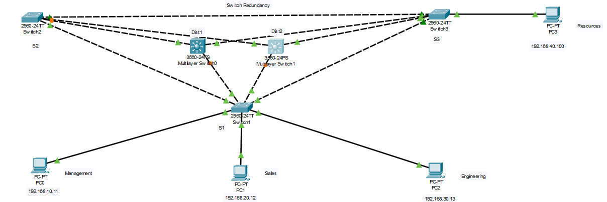

# STP-Enterprise-Network-Simulation
This project simulates a Layer 2 and Layer 3 enterprise network in Cisco Packet Tracer, demonstrating switch and router redundancies.
# Spanning Tree Protocol (STP) & Enterprise Network Simulation - Cisco Packet Tracer

## 📁 Repository Structure

```
STP-Simulation/
├── README.md
├── topology/
│   ├── network_diagram.png
│   └── STP-Simulation.pkt
├── configs/
│   ├── Dist1.txt
│   ├── Dist2.txt
│   ├── S1.txt
│   ├── S2.txt
│   └── S3.txt
└── notes/
    └── simulation_instructions.md
```

---

## 📘 README.md (Summary)

### 🧠 Overview

This project simulates a Layer 2 and Layer 3 enterprise network in **Cisco Packet Tracer**, demonstrating:

* Spanning Tree Protocol (Rapid-PVST)
* VLAN segmentation
* Inter-VLAN routing (via Layer 3 switches)
* Gateway redundancy using HSRP
* Optional EtherChannel, SNMP, Syslog integrations

### 🔧 Technologies Used

* Cisco Packet Tracer (v8.x)
* Cisco IOS CLI (3560 Multilayer Switches)
* STP (802.1w - Rapid PVST)
* HSRP for Layer 3 redundancy
* VLANs, trunking, access ports

---

### 🏗️ Network Design

* 3 Access Switches (S1, S2, S3)
* 2 Distribution Layer 3 Switches (Dist1, Dist2)
* 4 End Devices:

  * PC0 - VLAN 10 (Management)
  * PC1 - VLAN 20 (Sales)
  * PC2 - VLAN 30 (Engineering)
  * PC3 - VLAN 40 (Resources)

### 🔌 VLAN and IP Scheme

| VLAN | Name        | Subnet          | Virtual Gateway |
| ---- | ----------- | --------------- | --------------- |
| 10   | Management  | 192.168.10.0/24 | 192.168.10.1    |
| 20   | Sales       | 192.168.20.0/24 | 192.168.20.1    |
| 30   | Engineering | 192.168.30.0/24 | 192.168.30.1    |
| 40   | Resources   | 192.168.40.0/24 | 192.168.40.1    |

### 🛠️ STP Configuration

* **Rapid-PVST** mode enabled on all switches
* **S3** is Root Bridge for all VLANs
* Redundant links blocked by STP dynamically

### 🔄 HSRP Redundancy

* **Dist1**: Active router for all VLANs (priority 110)
* **Dist2**: Standby router (priority 100)
* Clients use virtual IP as gateway (e.g., 192.168.10.1)

---

### 🦪 Testing Steps

1. Verify PCs in different VLANs can ping each other
2. Shut down a trunk link between S1 and S3 — STP reroutes via S2
3. Power off Dist1 — Dist2 takes over as gateway using HSRP

### 📦 Files

* `.pkt` file: Open in Cisco Packet Tracer
* `configs/`: Full CLI output from each switch
* `topology/`: 
* `simulation_instructions.md`: Setup guide and testing notes

---
